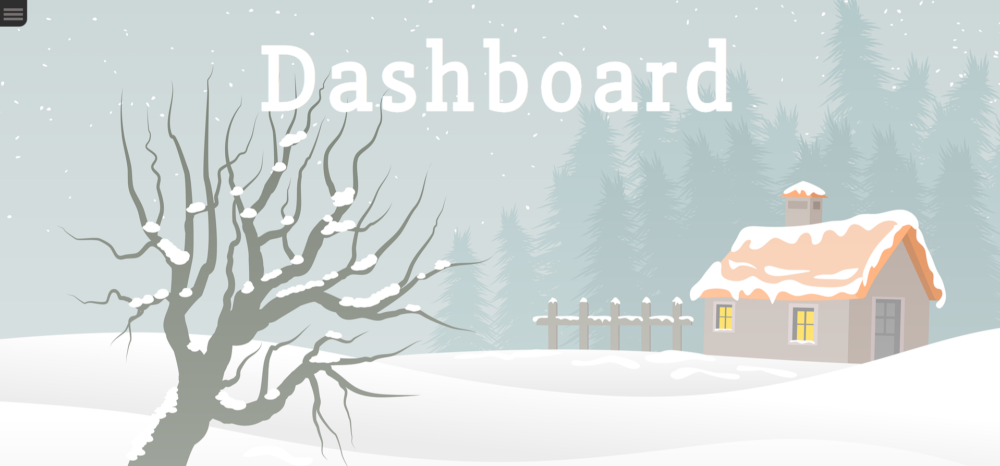
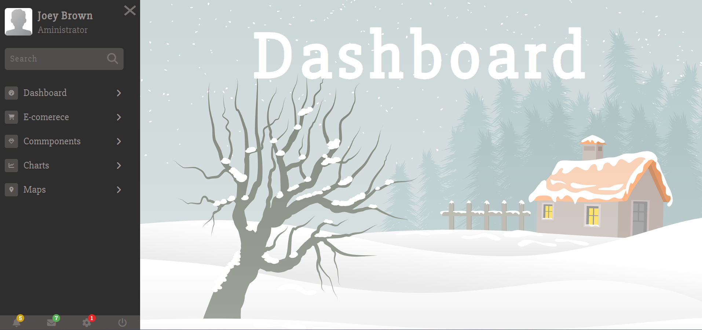

# sidebarMenu
 

## Description
An example of a user admin panel created using HTML, CSS, and JavaScript.  Up on loading the user is greated with an image and a hamburger menu in the top left corner.  When the user clicks on the hamburger menu the dashboard is expanded.  The user can click on the different sections of the dashboard and more options are revealed and selectable.  The below image shows what the dashboard looks like when the hamburger is clicked.

## Demo
A demo for the project can be found at:  https://tod619.github.io/sidebarMenu/
